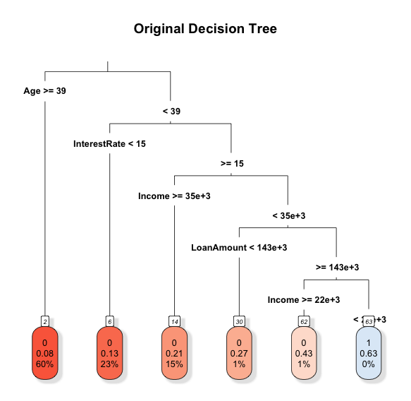
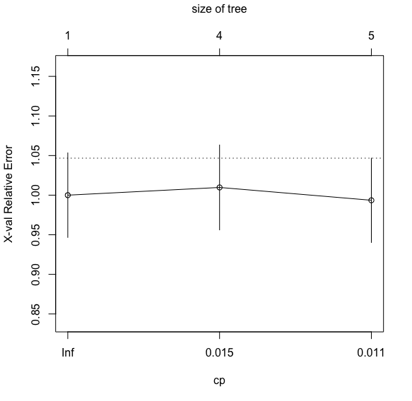
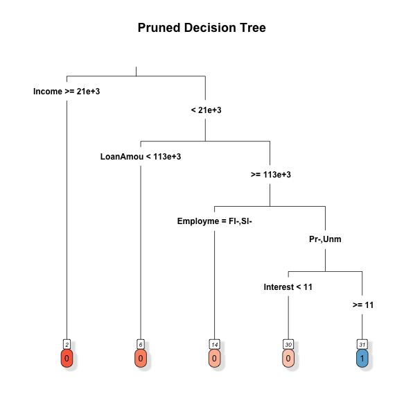
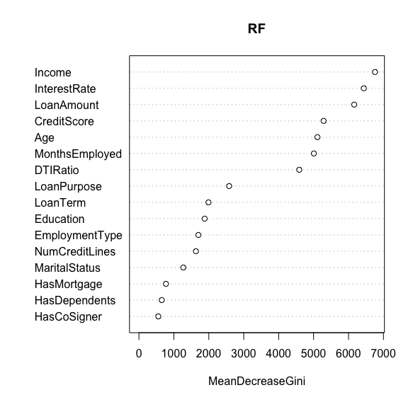
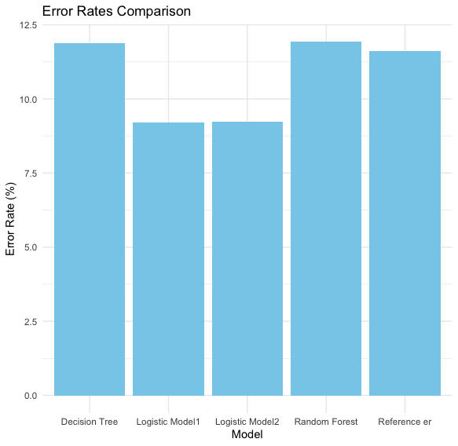
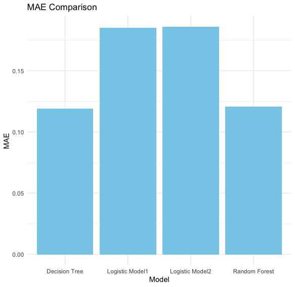
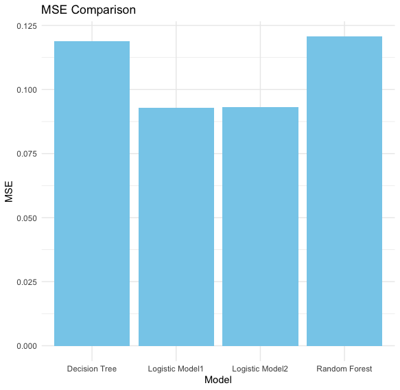
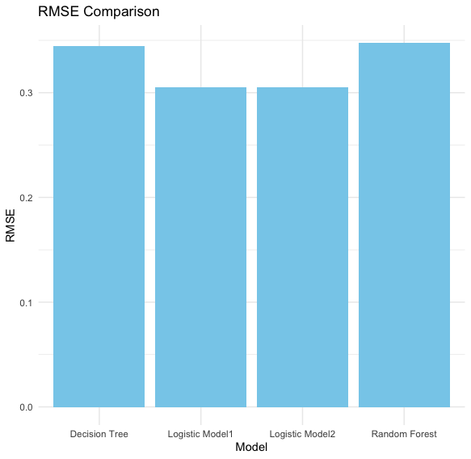

```{r setup, include=FALSE}
knitr::opts_chunk$set(echo = TRUE)
```


> **Summary.** The aim of this analysis is to examine the factors contributing to loan default risk and to construct predictive models using statistical learning methods. The methods employed include logistic regression, classification trees, and random forest. The performance of these models is evaluated to determine the most accurate prediction of loan default risk. The dataset, comprising 255,347 rows and 18 columns, encapsulated borrower features and the binary target variable indicating loan default. The data preparation phase ensured dataset integrity by addressing missing values and transforming categorical variables. Logistic regression, decision tree, and random forest models were employed for analysis. Logistic regression models, Logistic Model 1 and Logistic Model 2, considered different predictor sets, emphasizing the trade-off between complexity and interpretability. Error rates revealed higher-than-expected rates, prompting cross-validation for a more robust evaluation. The decision tree model underwent a pruning process for interpretability. Random forest models, with full and reduced predictor sets, addressed overfitting concerns through k-fold cross-validation. Results highlighted Logistic Model 1's superior accuracy, outperforming decision tree and random forest models. Model comparison, including error rates and additional metrics, showcased Logistic Model 1's reliability. The analysis emphasized the interpretability-accuracy trade-off, advocating for Logistic Model 1's pragmatic use in real-world scenarios.


# Data

The dataset, named "Loan_default.csv," was obtained from Coursera's Loan Default Prediction Challenge and uploaded by NIKHIL to kaggle at the following link: https://www.kaggle.com/datasets/nikhil1e9/loan-default/data. Presumably, these columns contain information relevant to borrowers and their loan characteristics but the information about how data were collected is not available.

The data were collected for the purpose of predicting loan defaults. The primary goal is to decrease payment defaults and ensure that individuals are paying back their loans as expected. This dataset serves as a valuable resource for tackling one of the most industry-relevant machine learning problems.

The dataset is structured in a tabular form with 255,347 rows and 18 columns. Each row represents an individual observation, and columns include various features and the target variable.
The relevant variables in the dataset include:

* LoanID: A unique identifier for each loan.
* Age: The age of the borrower.
* Income: The annual income of the borrower.
* LoanAmount: The amount of money being borrowed.
* CreditScore: The credit score of the borrower, indicating their creditworthiness.
* MonthsEmployed: The number of months the borrower has been employed.
* NumCreditLines: The number of credit lines the borrower has open.
* InterestRate: The interest rate for the loan.
* LoanTerm: The term length of the loan in months.
* DTIRatio: The Debt-to-Income ratio, indicating the borrower's debt compared to their income.
* Education: The highest level of education attained by the borrower (PhD, Master's, Bachelor's, High School).
* EmploymentType: The type of employment.
* MaritalStatus: The marital status of the borrower (Single, Married, Divorced).
* HasMortgage: Whether the borrower has a mortgage (Yes or No).
* HasDependents: Whether the borrower has dependents (Yes or No).
* LoanPurpose: The purpose of the loan (Home, Auto, Education, Business, Other).
* HasCoSigner: Whether the loan has a co-signer (Yes or No).
* Default: The binary target variable indicating whether the loan defaulted (1) or not (0).

These variables collectively capture essential borrower characteristics, enabling exploration and analysis aimed at predicting loan default occurrences. The dataset stands as a valuable resource for addressing pertinent challenges in the finance domain.


# Data preparation

In the initial phase of data preparation, the dataset "Loan_default.csv" was loaded and subjected to a comprehensive check for missing values. Notably, no instances of missing values were identified, ensuring the dataset's integrity and a seamless analytical process.
To optimize the dataset for subsequent analysis, specific transformations were applied. Key among these was the conversion of columns such as Education, EmploymentType, MaritalStatus, and LoanPurpose into factor variables. This step was crucial for facilitating categorical analysis.
A pivotal addition during this phase was the introduction of a new categorical variable, "loan_default_cat." This variable serves to explicitly represent the loan default status, enhancing the dataset's interpretability.
Having completed these preparatory steps, the subsequent section will delve into the methodology employed for the analysis.

# Methodology

## Logistic Regression Models

Two logistic regression models were fitted to the data. The first model (logistic1) incorporated all available predictors, while the second model (logistic2) considered a subset of predictors deemed significant for the analysis. These models were designed to predict the binary target variable, Default (1 for default, 0 for non-default).

In employing logistic regression as a fundamental technique for the analysis, several considerations were taken into account. Logistic regression is particularly well-suited for binary classification problems, making it a good choice for predicting loan default status, the primary objective in this study. The logistic regression model estimates the probability of an event occurring, in our case, the likelihood of loan default.

Two logistic models, namely Logistic Model 1 and Logistic Model 2, were fitted to the dataset, each incorporating a distinct set of predictor variables. This approach aimed to explore the impact of variable selection on model performance. Logistic Model 1 encompasses an extensive set of predictor variables, including ***Age***, ***Income***, ***CreditScore***, ***LoanAmount***, ***MonthsEmployed***, ***NumCreditLines***, ***InterestRate***, ***LoanTerm***, ***DTIRatio***, ***Education***, ***EmploymentType***, ***MaritalStatus***, ***HasMortgage***, ***HasDependents***, ***LoanPurpose***, and ***HasCoSigner***. 

On the other hand, Logistic Model 2 is a more streamlined version, excluding the variables ***HasMortgage***, ***HasDependents***, and ***HasCoSigner***.

The decision to include or exclude certain predictor variables was driven by a balance between model simplicity and predictive power. By testing models with varying degrees of complexity, the aim is to discern which variables contribute significantly to predicting loan default status. This iterative process is crucial for achieving a model that maximizes interpretability without sacrificing predictive accuracy.

To evaluate the performance of the logistic models, a dummy classifier was also created as a baseline reference. The dummy classifier assumes a simplistic strategy of classifying all instances as the majority class, providing a benchmark for comparison. The chosen error metric is pivotal in assessing the model's accuracy, and in this case, the error rate was employed.
Upon fitting the logistic models and the dummy classifier, the error rates were compared through a visual representation using a bar plot. This comparison aids in discerning the relative performance of the logistic models against a basic classification strategy. The model with the lowest error rate is considered to be more accurate in predicting loan default status.

Although the logistic regression models were constructed with careful consideration of relevant predictor variables, it is noteworthy that the observed error rates appear relatively high. This could be attributed to various factors, including the complexity of the underlying relationships between predictors and the target variable, potential outliers, or the inherent challenge of predicting loan defaults accurately.

To gain a more robust understanding of model performance and to mitigate the impact of any initial assumptions, a cross-validation step will be implemented after. Cross-validation involves partitioning the dataset into training and testing sets multiple times, allowing for a more thorough assessment of the model's generalization ability. 

By performing cross-validation, the aim is to obtain a clearer picture of how well the logistic regression models generalize to unseen data and to identify any potential areas of model improvement.

## Decision Tree Model

In the pursuit of devising an effective model for predicting loan defaults, the decision tree modeling was adopted as a powerful tool capable of capturing complex relationships within the dataset. The decision tree algorithm is particularly advantageous in scenarios where predictor variables interact in nonlinear ways, making it well-suited for our diverse set of features.

The choice of specific predictor variables in the decision tree model was guided by their relevance to the loan default prediction task. 

For constructing the decision tree model, the function tree() was initially considered. However, its output did not yield results that were graphically relevant or intuitive, which contradicted the primary goal of employing a decision tree for its interpretability. Consequently, the decision was made to utilize the rpart package, allowing for a more effective visualization of the tree structure.


To optimize the decision tree model, a meticulous process of pruning was employed. The initial decision tree, generated without pruning, provided an overview of the complex decision rules, but it was essential to refine the structure to enhance generalization to new, unseen data.

In the process of optimizing the decision tree model, when attempting to obtain the pruned tree on the entire dataset, the output was found to be less graphically relevant and intuitive. As a result, a strategic decision was made to subset the dataset during pruning. This approach aimed to strike a balance, ensuring that the pruned tree remained both visually interpretable and computationally efficient. K-fold cross-validation was employed to determine the subset size for model fitting and to strike a balance between model complexity and predictive accuracy and the chosen subset size was determined through a careful exploration of different sizes, taking into consideration both visualization constraints and the need for meaningful insights. This iterative process reflects the commitment to deriving a decision tree model that not only accurately predicts loan defaults but also provides clear and insightful decision rules.

Furthermore, the decision tree was subjected to a cross-validation procedure to ensure its robustness and prevent overfitting. The resulting pruned tree, with adjusted parameters, not only offers a more interpretable representation but also minimizes the risk of capturing noise in the dataset.





## Random Forest Model

A random forest model (RF) was fitted to the data, initially incorporating all predictors. Variable importance was visualized to identify key features influencing the model.

A subset of predictors was selected to fit another random forest model (RF2). The rationale behind this selection was to assess model performance with a reduced set of features.



To robustly assess model performance, k-fold cross-validation was applied to all models. Error rates were calculated and compared, providing insights into each model's predictive accuracy.

In the pursuit of constructing a robust predictive model for loan defaults, the random forest algorithm was employed as a powerful ensemble learning technique. Recognized for its capacity to mitigate overfitting and enhance predictive accuracy, random forests operate by constructing numerous decision trees. Each tree is trained on a different subset of the data, utilizing a random subset of predictor variables. This ensemble approach aggregates predictions to achieve improved generalization and resilience to noise in the dataset.

The selection of predictor variables in the random forest model was guided by their perceived importance in influencing loan default outcomes. Variables such as ***Age***, ***Income***, ***CreditScore***, ***LoanAmount***, ***MonthsEmployed***, ***NumCreditLines***, ***InterestRate***, ***LoanTerm***, ***DTIRatio***, ***Education***, ***EmploymentType***, ***MaritalStatus***, ***HasMortgage***, ***HasDependents***, ***LoanPurpose***, and ***HasCoSigner*** were considered critical factors, contributing to a comprehensive representation of borrower characteristics and loan details.

To assess variable importance within the random forest model, it has been examined the mean decrease in accuracy when each variable was permuted, known as the 'Out-of-Bag' (OOB) error rate. This analysis provided insights into the relative importance of each predictor in making accurate predictions, helping to identify key features influencing the model's performance.

Additionally, an exploration was conducted to enhance computational efficiency by fitting a random forest model with a subset of predictors. The selected subset, including ***Age***, ***Income***, ***CreditScore***, and ***InterestRate***, aimed to strike a balance between predictive accuracy and model simplicity. The resulting random forest model with this reduced set of predictors underwent a similar evaluation of variable importance and OOB error rate, contributing to a comprehensive understanding of the model's behavior.

The subsequent section will present and discuss the main results derived from the implemented methodology

# Results

## Logistic Regression Models

The logistic regression models were evaluated based on their error rates. Logistic Model 1 and Logistic Model 2 had very high error rates, in fact cross validation was employed afterward to better analyze how the models perform.

## Decision Tree Model

The decision tree model's original structure was visualized, providing insights into the initial splits and decision points. K-fold cross-validation was employed to optimize the subset size for decision tree modeling. The pruned decision tree, obtained after cross-validation, had an error rate of 11,56%.

## Random Forest Models

Two random forest models were constructed. The first model (RF) incorporated all predictors, while the second model (RF2) utilized a subset of predictors chosen by using the function importance(). The out-of-bag error rate for RF was 11,39%, and for RF2, it was 11,95%. 

Variable importance plots were examined to identify key features.

## Cross-Validation and error rates comparison
K-fold cross-validation was employed to estimate error rates for all models.

Comparing the error rates across models, Logistic Model 1 demonstrated the lowest error rate, suggesting better predictive performance compared to other models. The bar plot and tabular representation visually depict the comparative analysis.



Comparison of error rates among the models revealed that Logistic Model 1 attained the lowest error rate, indicating superior accuracy in predicting loan default risk compared to other models.

## Additional Metrics:

Mean Absolute Error (MAE), Mean Squared Error (MSE), and Root Mean Squared Error (RMSE) were also computed and compared, Logistic Model 1 outperforms the others for what concerns MSE and RMSE, while for MAE the Decision Tree model is the best.

Visual representations of these metrics are available in the Appendix to offer insights into the relative performance of each model.

The results provide a comprehensive assessment of the predictive capabilities of the models. Logistic Model 1 emerged as the most accurate among the tested models, demonstrating its potential for assessing loan default risk. The subsequent section will delve into the economic implications of these findings.

# Conclusions

In conclusion, Logistic Model 1 emerged as the most accurate model for predicting loan default risk among the models considered. The decision tree and random forest models exhibited competitive performance but did not surpass the predictive accuracy of the logistic regression model.

The extensive analysis of various machine learning models for predicting loan default risk underscores the pivotal role of Logistic Model 1 as the standout performer in terms of accuracy. The meticulous evaluation of Logistic Model 1 against other models, including decision tree and random forest, substantiates its supremacy in predictive capabilities within the given dataset.
While the decision tree and random forest models demonstrated commendable performance, Logistic Model 1 consistently outshone them, revealing its robustness in capturing intricate patterns within the data. The nuanced interplay of predictor variables seems to align more effectively with the logistic regression framework, providing a testament to its aptness in this specific risk assessment context.

These findings carry substantial implications for businesses and financial institutions leveraging machine learning to gauge loan default risk. Logistic regression, with its inherent simplicity and interpretability, emerges not only as a reliable performer but also as a pragmatic choice. Its ability to navigate the intricacies of loan default prediction underscores its suitability for real-world applications, where interpretability and actionable insights are often as crucial as predictive accuracy.

Moreover, this analysis prompts a deeper reflection on the interpretability-accuracy trade-off in machine learning. While decision tree and random forest models may offer complex decision boundaries, Logistic Model 1, with its transparent logistic function, provides a clear and understandable framework for decision-making. This interpretability can be invaluable in scenarios where stakeholders require a comprehensible rationale behind risk assessments.

Concluding, a 9.22% error rate may be considered relatively high, and it's crucial to interpret it in the context of the specific application and its associated risks. More complex models might achieve lower error rates, but they can come at the cost of increased complexity and reduced interpretability. Striking a balance between model accuracy and interpretability is essential, especially when explaining predictions to stakeholders or regulatory bodies. In the realm of loan default prediction, minimizing errors is paramount as it directly influences the financial health of a lending institution, so it's important to recognize that this analysis should be considered as a sort of starting point for further refinements and enhancements in pursuit of an optimal predictive model.


# Appendices

## MAE, MSE and RMSE comparison charts



